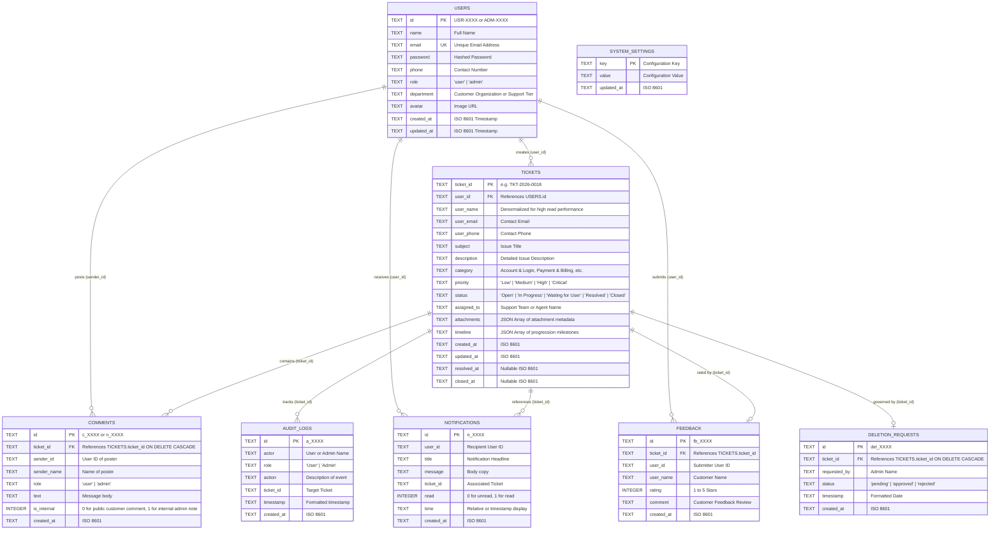

# ResolveDesk — Database Modeling, Backend Architecture & API Guide

## 1. Database Modeling & Relational Schema

ResolveDesk uses a relational database architecture implemented on **SQLite** (using Node.js native `node:sqlite`), which provides instant zero-configuration setup, local persistence (`server/db/resolvedesk.db`), and full relational integrity with foreign keys enabled.

### 1.1 Entity-Relationship (ER) Diagram



---

## 2. Backend REST API Reference

The backend runs on **port 5001** (or proxied seamlessly through Vite on **port 3000** under `/api`).

### 2.1 Tickets Endpoints

| Method | Endpoint | Description | Query / Body Params |
|---|---|---|---|
| `GET` | `/api/tickets` | List tickets with filters | `?userId=&status=&priority=&category=&search=` |
| `GET` | `/api/tickets/:id` | Get single ticket with comments & internal notes | `:id` (e.g. `TKT-2026-0018`) |
| `POST` | `/api/tickets` | Create a new ticket | `{ subject, description, category, priority, attachments, userId, userName, userEmail }` |
| `PATCH` | `/api/tickets/:id/status` | Update status, priority, or assigned agent | `{ status, priority, assignedTo, actorName, role }` |
| `POST` | `/api/tickets/:id/comments` | Post a public reply or internal staff note | `{ senderId, senderName, role, text, isInternal }` |
| `POST` | `/api/tickets/:id/deletion-request` | Initiate customer deletion consent workflow | `{ requestedBy }` |
| `PATCH` | `/api/tickets/:id/deletion-response` | Approve (purge) or reject deletion request | `{ approved: boolean, userName }` |

### 2.2 Users & Analytics Endpoints

| Method | Endpoint | Description |
|---|---|---|
| `GET` | `/api/users` | List all users with aggregated ticket counts |
| `GET` | `/api/users/:id` | Get user details |
| `GET` | `/api/stats/summary` | Get aggregated KPI metrics, SLA stats, and category distribution |
| `GET` | `/api/audit-logs` | Get activity logs (supports `?ticketId=`) |
| `GET` | `/api/notifications` | Get notifications (supports `?userId=`) |
| `PATCH` | `/api/notifications/:id/read` | Mark single notification as read |
| `PATCH` | `/api/notifications/read-all` | Mark all notifications as read |
| `GET` | `/api/feedback` | List all customer feedback ratings |
| `POST` | `/api/feedback` | Submit CSAT rating (`ticketId`, `rating`, `comment`) |
| `GET` | `/api/settings` | Get system SLA thresholds and auto-assignment rules |
| `POST` | `/api/settings` | Update system configuration parameters |

---

## 3. How to Run

### Development Mode (Runs Frontend + Backend simultaneously)
```bash
npm run dev
```
- Frontend UI: `http://localhost:3000`
- Backend REST API: `http://localhost:5001` (also proxied via `http://localhost:3000/api`)

### Run Backend Standalone
```bash
npm run server
```

### Run Frontend Standalone
```bash
npm run client
```

### Production Build
```bash
npm run build
```
